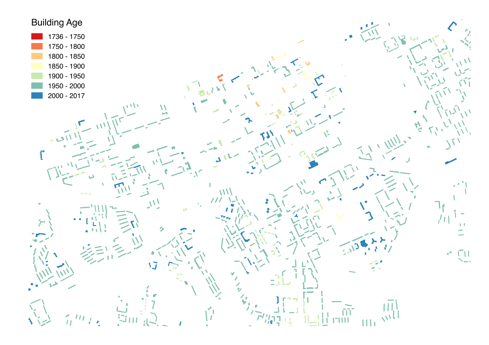

```{r setup, include=FALSE}
knitr::opts_chunk$set(echo = TRUE)
```

***

### 4.1. QGIS layout

Load the data and style your map  
**Right-click on layer in Layers Panel -> Properties -> Style -> Graduated -> column:year**  
Choose color palette and breaks mode  
  
Print or export as image:  
**Projects -> Create layout**  
**Layout -> Add map -> Add legend -> Export as image**  



### 4.2. Web-cartography

<a href="https://carto.com">**Carto**</a>  
<a href="https://www.mapbox.com">**Mapbox**</a>  

**Algorithm**:  
* Upload dataset   
* Create map form dataset  
* Style map  
* Publish or Export the map  

In Carto:  
**Log in -> Your Dataset -> New Dataset -> Browse -> Choose file -> Connect data set**
**Create and style your map**  
