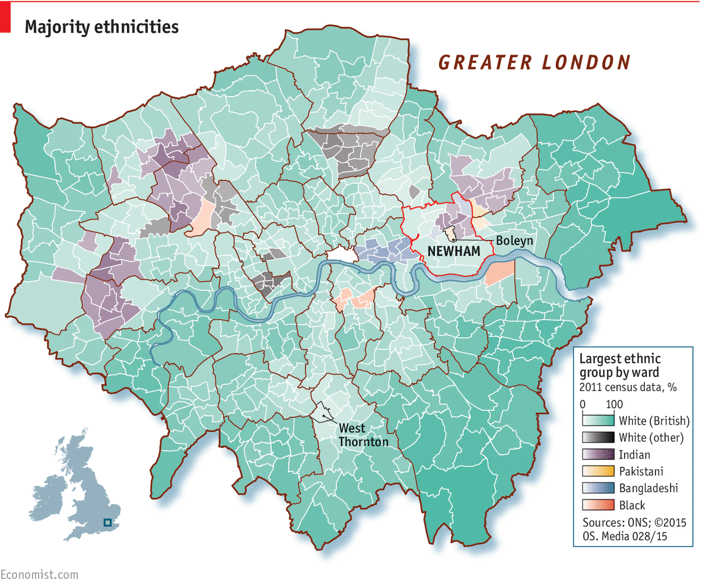

```{r setup, include=FALSE}
knitr::opts_chunk$set(echo = TRUE)
```

**starting picture and epigraph**

## Part 1. Basic concepts
### 1.1. Spatial data

Distance - direction - spatial relations - geogrphical position - geographical context

*Classroom case*

### 1.2. Spatial data types

Spatial phenomena can generally be thought of as either discrete locations (spatial objects) or as continuous phenomena, for example, elevation, temperature, population density, etc.

**Spatial data**:  
+ raster data (*continuous phenomena*)  
+ vector data (*spatial objects*)

  
*Source*: <http://sedac.ciesin.columbia.edu/data/collection/gpw-v3/methods/grid>

#### 1.2.1 Raster data

A raster divides the area into a grid of equally sized rectangles (*cells* or pixels). The *resolution* of the raster represents the size of one cell.  
All the cells have values (or a missing value) for the variables of interest.  
Cell value normally represents the average (or majority) value for the area it covers. It refers to an *intensity* of the process.

**ASTER GDEM 2011** elevation data

```{r elevation, echo=TRUE, fig.width=7}

library(sp)
library(raster)
library(RColorBrewer)
library(lattice)
library(latticeExtra)
library(rasterVis)

# Read raster data
elev <- raster("data/ASTGTM2_N58E056_dem.tif")
# Plot 
levelplot(elev, margin=FALSE, colorkey=list(space='bottom',
                                            labels=list(at=seq(0,350, 50), font=4),
                                            axis.line=list(col='black'),
                                            width=0.75),    
          par.settings=list(strip.border=list(col='transparent'),
                            strip.background=list(col='transparent'),
                            axis.line=list(col='transparent')),
          xlab = NULL,
          ylab = NULL,
          scales=list(draw=FALSE),
          col.regions=colorRampPalette(rev(brewer.pal(8, 'RdYlGn'))[1:7]), 
          alpha.regions = 0.7,
          at=seq(0,350, 50),
          names.attr="bbb")

```

```{r leaflet, echo=TRUE, out.width="100%"}
library(leaflet)
# Load leaflet map
leaflet() %>% setView(lng = 56.33, lat = 58.3, zoom = 9) %>% addTiles()

```
<style></style>

**Other examples**:  
Population Density: <http://luminocity3d.org/WorldPopDen/>  
"A Nation divided" by Die Zeit:   <http://www.zeit.de/feature/german-unification-a-nation-divided>

#### 1.2.2 Vector data

The main vector data types are points, lines and polygons. In all cases, the geometry of these data structures consists of sets of coordinate pairs (x, y). **Points** are the simplest case. Each point has one coordinate pair.  
**Lines** are represented as ordered sets of coordinates (nodes). The actual line segments can be computed by connecting the points.  
A **polygon** refers to a set of closed polylines. The geometry is very similar to that of lines, but to close a polygon the last coordinate pair coincides with the first pair.

```{r vector data, echo=FALSE}
# let’s make some objects of Spatial* class from scratch
longitude <- c(-116.7, -120.4, -116.7, -113.5, -115.5, -120.8, -119.5, -113.7, -113.7, -110.7)
latitude <- c(45.3, 42.6, 38.9, 42.1, 35.7, 38.9, 36.2, 39, 41.6, 36.9)
lonlat <- cbind(longitude, latitude)
pts <- SpatialPoints(lonlat)

# We did not set the coordinate reference system. Let's do it
crdref <- CRS('+proj=longlat +datum=WGS84')
pts <- SpatialPoints(coords = lonlat, proj4string = crdref)

# We can use SpatialPoints object to create SpatialPintsDataFrame
df <- data.frame(ID=1:nrow(lonlat), precip=(latitude-30)^3)
# combine SpatialPoints and DataFrame 
ptsdf <- SpatialPointsDataFrame(pts, data = df)

# To create SpatialLines and SpatialPlygons we can use spLines() and spPlolygons() (from raster package)
lon <- c(-116.8, -114.2, -112.9, -111.9, -114.2, -115.4, -117.7)
lat <- c(41.3, 42.9, 42.4, 39.8, 37.6, 38.3, 37.6)
lonlat <- cbind(lon, lat)
lns <- spLines(lonlat, crs=crdref)
pols <- spPolygons(lonlat, crs=crdref)

# Create maps
plot(pols,
     axes = T) # создает рамку с сеткой координат
plot(pols, border = "blue", col = "yellow", add = T)
points(pts, # SpatialPoints 
       pch = 20, # тип значка - точка
       col = "red", cex = 2)
```

#####**Spatial object** = *geometry* + *attributes*  

Cartogram - cartodiagrame  


Source: <https://www.economist.com/news/britain/21644155-britain-bangladeshis-have-overtaken-pakistanis-credit-poor-job-market-when-they-arrived>  

#### Building Age Maps
Chicago: <http://buildings.transitized.com>  
Amsterdam: <https://code.waag.org/buildings/#52.3663,4.8883,14>


### More to know about spatial analysis in R:

<http://rspatial.org/index.html>
